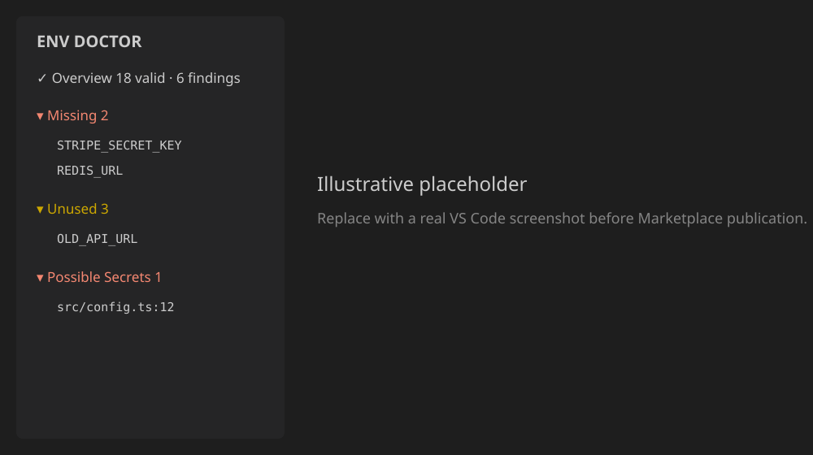
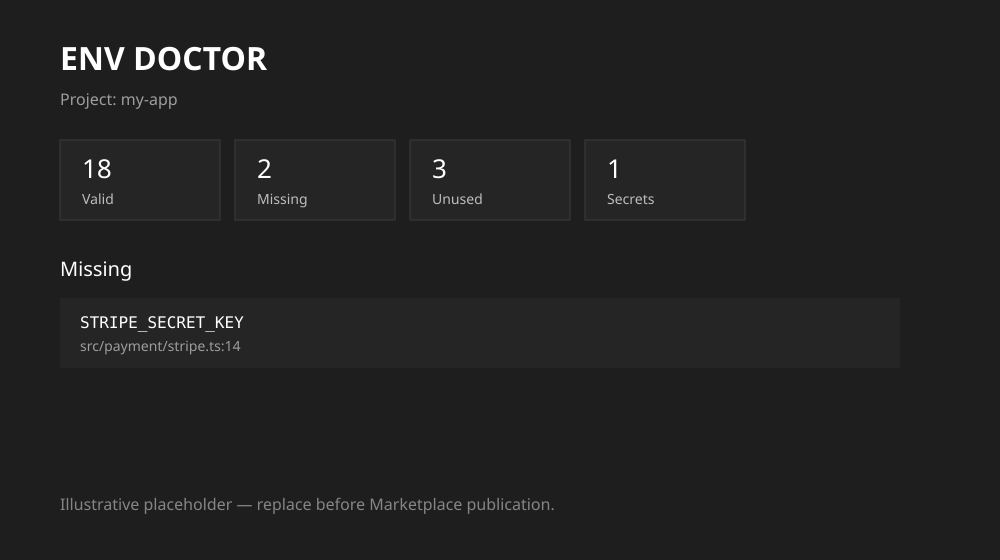

# Env Doctor

**Find missing, unused, inconsistent, and exposed environment variables before they break your application.**

Env Doctor is a privacy-first VS Code extension and CLI for auditing environment-variable usage across real projects. It scans locally, understands package boundaries, reports findings through native VS Code diagnostics and a Tree View, and never sends source code or `.env` contents to an external service.

> Status: production-oriented 1.0 implementation prepared for local packaging. Before Marketplace publication, replace the publisher/repository placeholders and capture real product screenshots.

## Why Env Doctor

Configuration drift is easy to miss: code references a variable that exists on one developer's machine but not in production; `.env.example` falls behind; an old variable remains forever; or a credential is accidentally hard-coded in a source file. Env Doctor answers four questions immediately:

- Which environment variables does this package use?
- Which referenced variables are missing?
- Which defined variables appear unused?
- Which environment files disagree?

It also generates safe `.env.example` files, validates configured rules, and performs local heuristic secret detection.

## VS Code experience

Env Doctor deliberately uses native developer-tool surfaces instead of a large dashboard:

- **Explorer Tree View** grouped by Missing, Unused, Possible Secrets, Environment Differences, Validation, and Parse Problems.
- **Diagnostics** in the editor and Problems panel.
- **Quick Fixes** to add empty variables to `.env`/`.env.example`, ignore a variable, or ignore a file.
- **Status bar** health summary.
- **Report panel** with package summary, findings, actions, and an environment matrix.
- **Command Palette** commands for scanning, comparison, validation, secret checks, and example generation.





These two images are intentionally illustrative placeholders. Capture real VS Code screenshots before publishing to the Marketplace.

## Supported technologies

### Source access detection

| Technology | Examples detected |
| --- | --- |
| JavaScript / TypeScript | `process.env.DATABASE_URL`, `process.env["DATABASE_URL"]`, destructuring from `process.env` |
| Vite | `import.meta.env.VITE_API_URL` |
| Next.js | `process.env.NEXT_PUBLIC_API_URL` with public-variable metadata |
| Python | `os.getenv()`, `os.environ[]`, `os.environ.get()` |
| PHP / Laravel | `env('DATABASE_URL')` |
| Docker / Compose | `${DATABASE_URL}` and environment pass-through forms |
| Shell | `$DATABASE_URL`, `${DATABASE_URL}` |

JavaScript and TypeScript are parsed with the TypeScript compiler AST. Dynamic access such as `process.env[name]` is retained as a low-confidence dynamic reference rather than being falsely attributed to a specific variable.

### Framework detection

Env Doctor detects useful project hints for Next.js, Vite, React, Node.js, NestJS, Express, Nuxt, Laravel, Django, Flask, Python/PHP projects, and Docker Compose. Framework detection influences reporting metadata without making the core analyzer framework-dependent.

## Environment files

Default dotenv-style files:

- `.env`
- `.env.local`
- `.env.development`
- `.env.development.local`
- `.env.production`
- `.env.production.local`
- `.env.test`
- `.env.test.local`
- `.env.example`
- `.env.sample`

Custom names can be added with `envDoctor.envFiles` or project-level `.envdoctorrc`.

The parser supports comments, whitespace, empty values, `export KEY=value`, single/double quotes, escaped double-quoted characters, and multiline quoted values. Actual values are used transiently only when local validation requires them; they are not put into diagnostics, reports, logs, CLI JSON, telemetry, or secret findings.

## Commands

Open the Command Palette and run:

- `Env Doctor: Scan Project`
- `Env Doctor: Show Report`
- `Env Doctor: Generate .env.example`
- `Env Doctor: Compare Environments`
- `Env Doctor: Find Missing Variables`
- `Env Doctor: Find Unused Variables`
- `Env Doctor: Scan for Secrets`
- `Env Doctor: Validate Configuration`
- `Env Doctor: Refresh`

`Refresh` clears the incremental cache; normal scans reuse unchanged parse results.

## Configuration

Example VS Code settings:

```json
{
  "envDoctor.autoScan": true,
  "envDoctor.scanOnSave": true,
  "envDoctor.scanOnOpen": true,
  "envDoctor.exclude": [
    "**/.git/**",
    "**/node_modules/**",
    "**/dist/**",
    "**/build/**"
  ],
  "envDoctor.envFiles": [
    ".env",
    ".env.local",
    ".env.example"
  ],
  "envDoctor.compareEnvFiles": [
    ".env.local",
    ".env.production",
    ".env.example"
  ],
  "envDoctor.missingSeverity": "warning",
  "envDoctor.unusedSeverity": "information",
  "envDoctor.secretSeverity": "error",
  "envDoctor.inconsistentSeverity": "information",
  "envDoctor.validationSeverity": "warning",
  "envDoctor.parseSeverity": "warning",
  "envDoctor.scanGitTrackedEnvFiles": true,
  "envDoctor.showStatusBar": true,
  "envDoctor.preserveNonSecretDefaults": false,
  "envDoctor.examplePlaceholders": {
    "STRIPE_SECRET_KEY": "<your-stripe-key>",
    "PORT": "3000"
  }
}
```

Safety controls `envDoctor.maxFileSizeKb` and `envDoctor.maxFiles` bound scans on unexpectedly large workspaces.

## `.envdoctorrc`

Project-level suppression and validation rules live in `.envdoctorrc`. JSON comments are accepted.

```jsonc
{
  "ignoredVariables": ["INTENTIONALLY_EXTERNAL"],
  "ignoredFiles": ["scripts/vendor-config.js"],
  "ignoredRules": ["secret.suspiciousAssignment"],
  "compareEnvFiles": [".env.local", ".env.production", ".env.example"],
  "rules": {
    "DATABASE_URL": {
      "required": true,
      "url": true
    },
    "STRIPE_SECRET_KEY": {
      "required": true,
      "secret": true
    },
    "PORT": {
      "integer": true
    },
    "DEBUG": {
      "boolean": true
    },
    "NODE_ENV": {
      "allowedValues": ["development", "test", "production"]
    }
  }
}
```

Supported rule validations today: `required`, `secret` metadata, `url`, `integer`, `boolean`, `regex`, and `allowedValues`.
Regex rules are length-bounded and reject backreferences, lookarounds, nested quantifiers, and other high-risk constructs so an untrusted workspace policy cannot easily block the extension host with catastrophic backtracking.

### Inline suppression

Put `ENV_DOCTOR_IGNORE` on the same line or immediately above a supported source/env access:

```ts
// ENV_DOCTOR_IGNORE
const externallyInjected = process.env.RUNTIME_MANAGED_KEY;
```

Use project-level rules for durable team policy; use inline suppression sparingly for a specific intentional finding.

## Safe `.env.example` generation

`Env Doctor: Generate .env.example` gathers known variable names from the selected package's env files and static source references. It then:

1. produces a value-free candidate by default;
2. optionally preserves only obvious non-secret defaults such as integers, booleans, `localhost`, and common environment names;
3. applies configured placeholders;
4. opens a VS Code diff preview;
5. asks before replacing an existing `.env.example`.

Credential-like names never inherit values from the source env file.

## Secret detection

Secret scanning is local and heuristic. It checks supported source/config files for:

- credential-like assignments (`API_KEY`, `SECRET`, `TOKEN`, `PASSWORD`, `PRIVATE_KEY`, `ACCESS_KEY`, etc.);
- selected high-signal provider formats such as Stripe live secret keys, GitHub tokens, AWS access-key IDs, and private-key headers.
- credential-like properties in JSON, YAML, TOML, INI, properties, XML, and common script/source files;
- credential-like values and credential-bearing URLs in `.env` files already tracked by Git.

Findings include confidence and a masked preview internally; the normal report intentionally does not display the complete credential. A heuristic finding is not a guarantee that a value is a real credential.

Untracked `.env` files are not treated as source-code leaks because their values are expected to contain secrets. When the workspace is a Git repository, Env Doctor locally uses `git ls-files` to identify tracked env files and warns only on credential-like values; set `envDoctor.scanGitTrackedEnvFiles` to `false` or pass CLI option `--no-git` to disable this check. Complete values are never included in findings or reports.

## Monorepos and multi-root workspaces

Package roots are inferred from `package.json`, `pyproject.toml`, `requirements.txt`, and `composer.json`. Files and env definitions are associated with the nearest package root, preventing an `.env` in `apps/api` from silently satisfying a reference in `apps/web`.

VS Code multi-root workspaces are scanned folder-by-folder and merged for presentation. Each workspace folder retains its own incremental engine and project configuration.

## CLI / CI

The same core engine powers the CLI:

```bash
env-doctor check
env-doctor check --format json
env-doctor check --format github
env-doctor check --root ./apps/api
env-doctor check --no-git
```

Human output is concise. JSON output is explicitly sanitized and never serializes environment values or detected literal secrets. GitHub format emits workflow annotations without values.

The CLI exits with:

- `0` when there are no missing variables, secret findings, or validation failures;
- `1` when configuration validation fails, a potential secret is found, or an env file cannot be parsed safely;
- `2` for CLI/setup errors.

Unused/inconsistency findings are advisory by default and do not independently fail CI.

## Privacy and security

The free/core product requires no account and no backend.

By default Env Doctor:

- does **not** send source code anywhere;
- does **not** upload `.env` files;
- does **not** implement telemetry;
- does **not** call an AI service;
- does **not** log secret values;
- does **not** include env values in CLI JSON;
- does **not** persist an environment-value cache.

The incremental cache stores source-reference metadata and masked secret findings only. Environment values are deliberately not cached, and returned reports contain redacted env definitions. When validation or example generation needs a value, it is read transiently and discarded after the operation. No cloud functionality is required for the free engine.

See [SECURITY.md](SECURITY.md) for reporting and security-design details.

## Architecture

```text
VS Code UI / CLI
      │
      ▼
EnvDoctorEngine
      │
      ├── WorkspaceScanner + incremental metadata cache
      ├── LanguageDetector registry
      │     ├── JS/TS AST
      │     ├── Python
      │     ├── PHP/Laravel
      │     ├── Docker/Compose
      │     └── Shell
      ├── Dotenv parser
      ├── Analyzers
      │     ├── missing
      │     ├── unused
      │     ├── environment comparison
      │     ├── validation
      │     ├── secret findings
      │     └── parse problems
      └── package/framework detection
```

Core domain logic contains no VS Code APIs. The licensing boundary is represented by `LicenseProvider`; the free implementation continues to work with no license or network service.

## Development

Requirements: Node.js 20+ recommended, npm, and VS Code 1.95+ for extension-host testing.

```bash
npm install
npm run compile
npm run watch
npm test
npm run lint
npm run format
npm run package
```

`npm run package` performs a clean compile and bundle, automated tests, TypeScript/ESLint/security lint, formatting verification, and deterministic compressed VSIX generation. The TypeScript AST runtime is included once as a production dependency.

Install the resulting package locally with VS Code's **Extensions: Install from VSIX...** command or, if the `code` CLI is available:

```bash
code --install-extension env-doctor-1.0.0.vsix
```

## Testing

The repository includes automated coverage for:

- dotenv parsing;
- JS/TS AST detection;
- Python/PHP/Docker/Shell detection;
- missing/unused/comparison analyzers;
- validation rules;
- local secret detection and masking;
- public-prefix exposure checks for credential-like Vite/Next.js variables;
- Git-tracked env-file checks and generic JSON/TOML secret scanning;
- `.envdoctorrc` parsing and suppression;
- workspace scanning and default exclusions;
- incremental cache behavior;
- monorepo package isolation;
- safe report serialization;
- VS Code command registration, Tree View, diagnostics, and Quick Fix providers through an API mock;
- a 1,200-file synthetic performance fixture.

A real VS Code Extension Host smoke run should still be performed on the target release platforms before Marketplace publication.

The performance test executes two scans of a generated 1,200-file TypeScript repository, requires the second scan to reuse at least 1,200 cached entries, and enforces a 20-second first-scan ceiling. Absolute timings vary by filesystem, CPU, antivirus, and concurrent load.

## Troubleshooting

**A variable is reported missing but CI injects it externally.** Add it to `.envdoctorrc` as an intentional policy/suppression, or document it in the relevant package. Env Doctor avoids pretending to know external deployment state.

**A variable is reported possibly unused.** Dynamic accesses downgrade confidence. Framework/runtime-provided names such as `NODE_ENV`, `PORT`, `HOST`, `CI`, and `DEBUG` are not aggressively reported as unused.

**A huge repository is slow.** Tighten `envDoctor.exclude`, lower `envDoctor.maxFiles`, and keep generated/vendor directories excluded. Subsequent scans reuse unchanged file results.

**An env file is malformed.** Env Doctor reports a parse problem and continues scanning other files instead of crashing the extension host.

## Known limitations

- Python/PHP/Docker/Shell detectors are syntax-aware pattern detectors rather than full language ASTs; JS/TS uses a real AST.
- Dynamic environment access cannot be resolved to a concrete variable without program data-flow analysis; such access intentionally reduces unused confidence.
- Package env inheritance in monorepos is conservative: an env file belongs to its nearest package root and is not automatically shared with every child package.
- Secret detection is heuristic, local, and intentionally conservative; it is not a replacement for a dedicated repository secret scanner.
- The current comparison engine compares variable presence, not semantic equivalence of secret values.
- Real Extension Host integration and Marketplace screenshots require a machine with VS Code installed; the included automated VS Code integration tests use a deterministic API mock.
- The initial UI is English-only; strings are kept out of core data models where practical, but a full localization catalog is not yet wired into VS Code's l10n APIs.

## Roadmap

High-value next steps:

1. Kubernetes manifests and richer Docker validation;
2. additional environment-reference parsers for Go, Ruby, Java, and .NET;
3. schema-driven env documentation and type generation;
4. GitHub Action wrapper around the existing CLI;
5. optional Pro policy provider behind the existing license/policy interfaces.

## Marketplace publication checklist

Before publishing:

1. replace `your-publisher-id` in `package.json`;
2. replace `your-org` repository, issue tracker, and homepage URLs;
3. capture real Tree View/report screenshots and replace placeholders;
4. create or select a Visual Studio Marketplace publisher;
5. create a Marketplace Personal Access Token with the required extension-management scope;
6. run `npm run package` and install/test the generated VSIX on Windows, macOS, and Linux as appropriate;
7. publish the verified VSIX using Microsoft's Marketplace tooling or portal.

Publication is **not** claimed by this repository.

## License

MIT — see [LICENSE](LICENSE).
